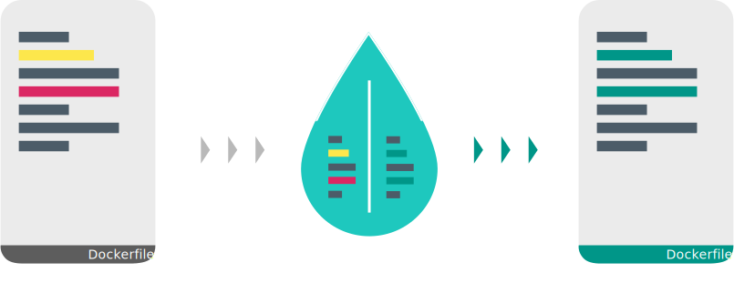

# Whalelint  

Dockerfile linter written in Go

*Disclaimer: this is a pet-project while I'm learning Golang.*

   

## Feature list

- [x] extendable ruleset
- [ ] cli
- [x] output as json
- [ ] rule escaping per line
- [ ] output coloring
- [ ] config file

## Rules

Each Dockerfile AST element has a corresponding set of rules. 

TODO

## Sample output

TODO

## Plugins

- JetBrains
- VSCode