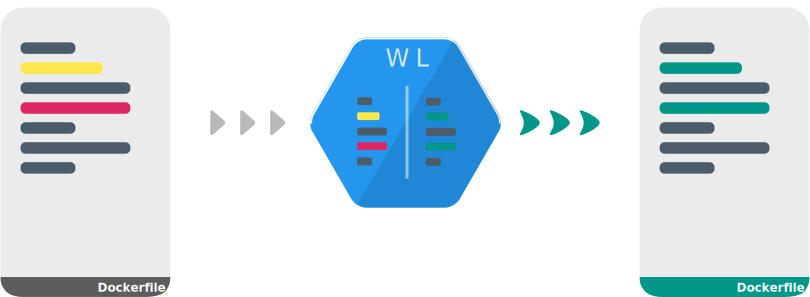

#  WhaleLint 

[](http://golang.org)

> *Disclaimer: this has started out as a pet-project while learning Golang.*

Dockerfile linter written in Go.

It provides static analysis for Dockerfiles, identifying common mistakes and promotes best practices.

<p align="center">
   
</p>

## Sample output

<p align="center">
  
</p>

## Rules

Each Dockerfile AST element has a corresponding set of rules. Click on the picture for details.

<p align="center"><a href="docs/rule/readme.md">
  
</a/</p>

## Development

### Roadmap

| Feature |  | Status |
|---|---|---|
| Extendable ruleset|  |  | 
| CLI |  |  |  |
| Configurable Output | | 
| - JSON |  |
| - Colored Summary |  |
| Docker image | |  |
| Rule pass | |  |
| - Per line |  |
| - Config file |  |
| Config file | |  |
| - Rule profiles |  |
| IDE plugins/extensions | | 
| - VSCode | 
| - JetBrains | 

### Design Decisions

A collection of documents describing the thought process behind selected design decisions. [Link >](docs/design/readme.md)

### Contribution Guide

[Link > TODO](docs/contribution/readme.md)

## Docker Image


```bash
docker pull cremindes/whalelint:[tag]
docker run --rm -v $(pwd)/Dockerfile:/Dockerfile cremindes/whalelint:[tag] Dockerfile
```

## Plugins

### JetBrains


<p align="center">
  
</p>

*Note: make sure, to also install the [Docker plugin](https://plugins.jetbrains.com/plugin/7724-docker) in case it's not bundled with the IDE.

### VSCode

[](https://marketplace.visualstudio.com/items?itemName=tamasgbarna.whalelint) 
[](https://marketplace.visualstudio.com/items?itemName=tamasgbarna.whalelint)

<p align="center">
  
</p>

## Alternatives

[Alternatives](docs/alternatives/readme.md)